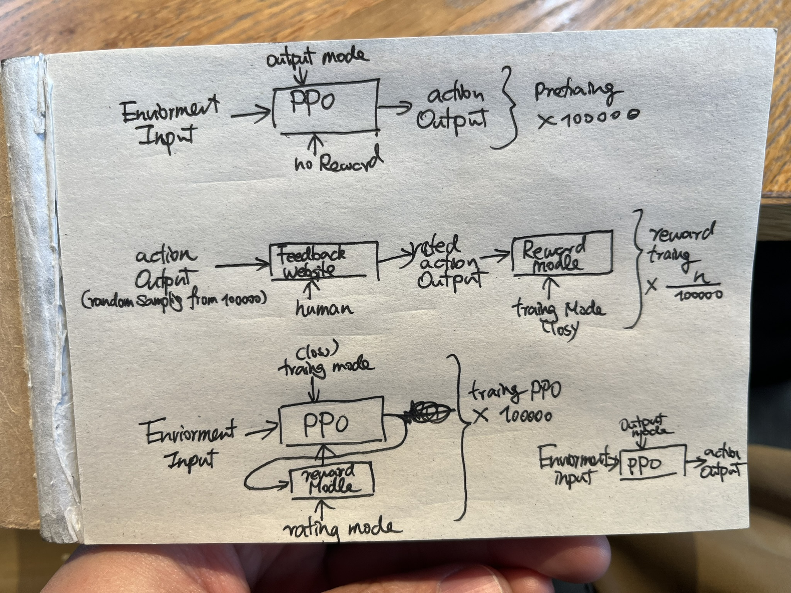

# **基于强化学习与人类反馈的AI定制解决方案**

## **概述**
提供基于强化学习（Reinforcement Learning, RL）和人类反馈优化的解决方案（Reinforcement Learning with Human Feedback, RLHF）。

可应用于复杂环境中的决策优化，以及具体任务的行为调整。

支持灵活选用不同的模型，满足广泛的通用控制需求，并根据具体需求进行深度定制。

---

## **服务流程**

### **1. 预训练阶段**

- 根据任务需求，选择适合的强化学习模型（如PPO、PEBBLE或其他前沿算法）。
- 在环境输入基础上进行预训练，生成初始策略，为后续优化奠定基础。

### **2. 反馈收集**

- 将模型输出动作通过反馈界面展示给用户，由人类对行为进行评分或评价。
- 支持多样化的反馈形式，如打分、优先级排序或对比选择。

### **3. 奖励模型优化**

- 基于用户反馈，训练奖励模型，使其能够准确反映偏好与任务目标。
- 利用奖励模型进一步指导强化学习模型的优化过程。

### **4. 强化训练与部署**

- 在强化学习阶段，通过高效迭代优化模型性能。
- 输出的最终策略可应用于实际场景，助力任务执行与决策支持。

---

## **核心特点**

- **算法多样性**：我们支持多种强化学习框架，如PPO、PEBBLE、SAC（Soft Actor-Critic）等，确保技术方案匹配您的具体需求。
- **广泛适配性**：该解决方案能够快速适应各种任务并交付成果。
- **个性化优化**：通过人类反馈实现高效调优，确保AI行为符合业务需求。
- **灵活定制**：从任务设计到部署方式均可根据客户需求调整，支持多阶段迭代开发。
- **技术透明性**：提供详细的技术流程和模型报告，保证可追溯性与透明度。
s/
---

## **应用场景**

广泛适用于但不限于游戏AI与角色操作、机器人控制、推荐系统、智能硬件控制等领域。

---

## **合作模式**

- 提供基于通用控制任务的标准化服务。
- 针对特定需求，预约面谈设计深度定制方案，包括选择合适模型和优化流程。
- 提供灵活的交付模式，如训练报告、模型部署支持及后续技术维护服务。

---

## **交付周期**

典型任务交付周期：

一周内完成模型预训练、反馈收集与优化训练，并生成可用的最终策略。

**注意：**交付周期仅指开发和优化过程，不包括计算资源运行所需时间。

---

## **附录：不适合的任务类型**

### **1. 规则明确的任务**

- **线性规划**：如简单的资源分配问题。不适合因为任务目标明确且可通过现有数学优化方法直接解决。
- **静态分类任务**：如图片分类。不适合因为监督学习模型已经非常成熟，效率和准确性更高。

### **3. 要求极端实时性或低延迟的任务**

- **高频交易系统**：决策时间在毫秒级，难以引入反馈优化。不适合因为强化学习训练时间长，无法满足毫秒级决策需求。
- **网络攻击响应系统**：需要即时判断，训练耗时过长。不适合因为响应时间至关重要，训练耗时可能导致滞后。

### **4. 涉及多媒体生成的任务（文字、图像等）**

- **文本生成**：如文章或代码生成。不适合，因为大语言模型（如GPT）得益于更加完善的数据集和为自然语言特化的注意力机制，特别需求时使用 Prompt 特调定制成本更低效果更佳。
- **图像生成**：如插画或设计。不适合因为现有生成模型（如Stable Diffusion）已能高效处理。

